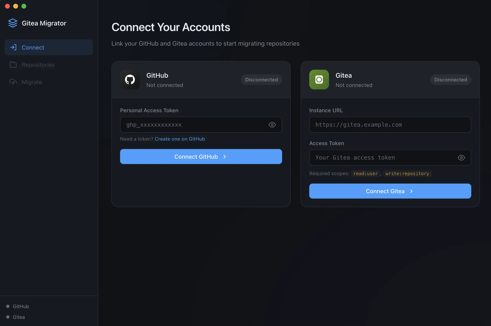

# Gitea Migrator

An Electron app to migrate your GitHub repositories to a Gitea instance.

 



## Features

- **Secure Authentication** - Connect with GitHub and Gitea using personal access tokens
- **Repository Listing** - View all your GitHub repositories with search and filtering
- **Bulk Selection** - Select individual repos or all at once
- **One-time Migration** - Full mirror clone including all branches, tags, and history
- **Live Mirror Migration** - Create Gitea pull mirrors that keep fetching new GitHub commits
- **Real-time Progress** - Watch the migration progress in real-time

## Getting Started

### Prerequisites

- [Bun](https://bun.sh/) or [Node.js](https://nodejs.org/) (v18+)
- Git installed on your system

### Installation

```bash
# Install dependencies
bun install

# Start the app
bun start
```

### Creating Access Tokens

#### GitHub Fine-grained Personal Access Token

1. Go to [GitHub Settings > Developer Settings > Fine-grained tokens](https://github.com/settings/personal-access-tokens/new)
2. Give it a descriptive name (e.g., "Gitea Migrator") and an expiration
3. Under **Repository access**, choose **All repositories** (or select the specific private repos you want to migrate). The default is **Public repositories** only, which is why your private repos wouldn't show up in the list.
4. Under **Repository permissions**, grant:
   - **Contents** → Read-only
   - **Metadata** → Read-only (required, granted automatically)
5. Click **Generate token**
6. Copy the token (starts with `github_pat_`)

> **Live mirror tip:** Gitea stores and reuses this token to keep fetching new commits. If you set an expiration, rotate the token before it lapses, or choose **No expiration** for an uninterrupted mirror. A one-time copy no longer needs the token once the migration finishes.

#### Gitea Access Token

1. Go to your Gitea instance and open `<your-instance>/user/settings/applications`
2. Under **Manage Access Tokens**, enter a token name (e.g., "Gitea Migrator")
3. Select the following scopes:
   - `write:user` - Required to verify the connection and create repos under your account
   - `write:repository` - Required to create repositories
4. Click **Generate Token**
5. Copy the token

## Usage

1. **Connect GitHub** - Enter your GitHub personal access token
2. **Connect Gitea** - Enter your Gitea instance URL and access token
3. **Select Repositories** - Browse and select the repos you want to migrate
4. **Choose Migration Mode** - Pick either a one-time copy or a live mirror
5. **Migrate** - Click "Migrate Selected" or "Create Live Mirrors" and watch the progress

## How It Works

### One-time copy

The migrator performs a **full clone** of each repository:

1. Clones the repository from GitHub with `--mirror` flag (includes all branches and tags)
2. Creates a new repository on your Gitea instance with matching settings
3. Pushes all branches (`--all`) and tags (`--tags`) to Gitea
4. Cleans up temporary files

**Note:** Your GitHub repositories are NOT deleted or modified. This is a copy operation only. GitHub-specific pull request refs are excluded as Gitea doesn't support them.

### Live mirror

Live mirror mode uses Gitea's official repository migration API to create a **pull mirror**:

1. Sends the GitHub repository URL and token to Gitea's `/api/v1/repos/migrate` endpoint
2. Creates a new Gitea repository with `mirror: true`
3. Lets Gitea periodically pull new branches, tags, and commits from GitHub

The default requested mirror interval is `10m`. Your Gitea instance may enforce its own mirror settings, such as `mirror.MIN_INTERVAL` and `mirror.DEFAULT_INTERVAL`, so actual sync timing is controlled by Gitea.

**Important:** Gitea can only create pull mirrors for repositories that do not already exist on your instance. If a repository already exists, use one-time copy mode or delete/rename the existing Gitea repository before creating a live mirror.

## Security

- In one-time copy mode, tokens are not stored by this app and only exist in memory during the session
- In live mirror mode, your GitHub token is sent to Gitea so Gitea can retain credentials and keep pulling future updates
- All communication uses HTTPS
- Context isolation for security

## Development

```bash
# Run in development mode
bun run dev
```

## License

MIT License - feel free to use and modify as needed.

